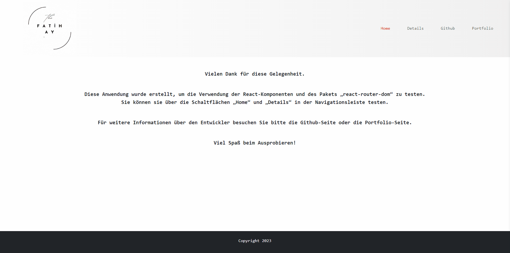
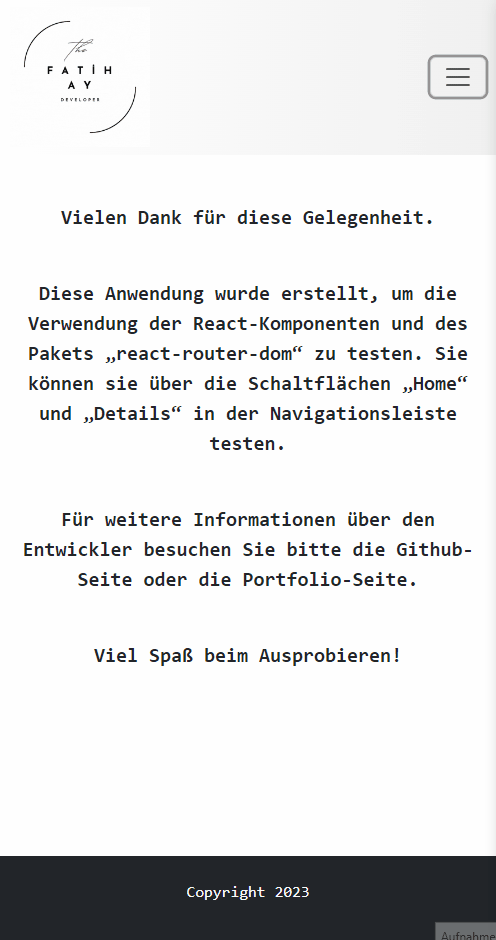

# Task Router

## Live Link: 

## Description

Welcome to the Task Router Application!
This application was created to test React components using the react-router-dom package. You can test it with the home and detail buttons on the navbar.

## Expected Outcomes

<div >


</div>

## Technologies, Libraries and Features

- <span style="font-size: larger;">**React.js**</span>: A powerful JavaScript library for building interactive user interfaces.
- <span style="font-size: larger;">**React Router**</span>: A popular routing library for React applications, allowing for dynamic and intuitive navigation between different pages within the application.
- <span style="font-size: larger;">**React Bootstrap**</span>: React Bootstrap is a library that provides Bootstrap components as reusable React components. It enables the use of Bootstrap's CSS and components in a React application, allowing for easy and quick development of responsive and mobile-first projects.
- <span style="font-size: larger;">**Responsive Design**</span>: Enjoy a smooth and intuitive user experience on various devices, including desktops, tablets, and mobile phones.
## Getting Started

To run the application on your local machine, follow these steps:

1. Clone the project to your computer:

   ```
   git clone https://github.com/iamfatihay/task-router.git
2. Open your terminal and navigate to the project directory.
   ```
   cd task-router
3. Install the dependencies:
    ```
    npm install
4. Start the application:
    ```
    npm start
5. Open your web browser and visit  **http://localhost:3000**  to explore the Task Router Application.

## Contribution
Welcome contributions to enhance the Task Router Application! If you find any bugs or have ideas for improvements, please open an issue or submit a pull request. I appreciate your valuable input!